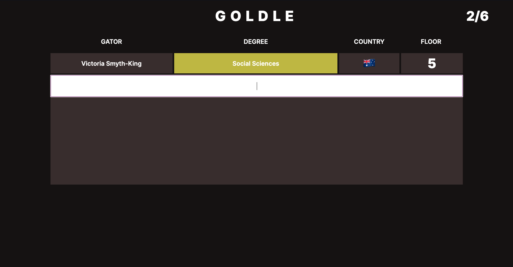

# Rules

You have 6 guesses to guess the mysterious gator.

With each guess, you will find out how close your guess is to the mysterious gator.

For the following examples, the mysterious gator is "Amber Chan"

### If your guessed gator's degree is in the same faculty as the mysterious gator, the following happens:

In the case of a double degree, if either of the degrees' faculties match, it will still show this condition.

### If your guessed gator's country is in the same continent as the mysterious gator, the following happens:

### If your guessed gator's floor is a neighbouring floor to the mysterious gator, the following happens:

### If your guessed gator is the mysterious gator, the following happens:

You win the game if you guess the mysterious gator within the 6 available guesses.
 
You lose if you are unable to guess the mysterious gator within the 6 available guesses.

<b>Upon either winning or losing the game, you can click the Play Again button or reload the page to play again.</b>